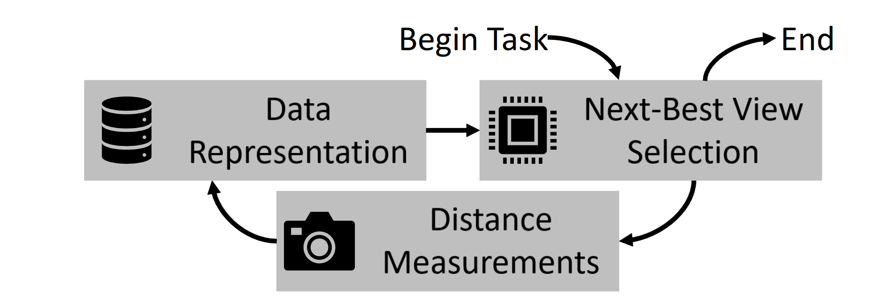
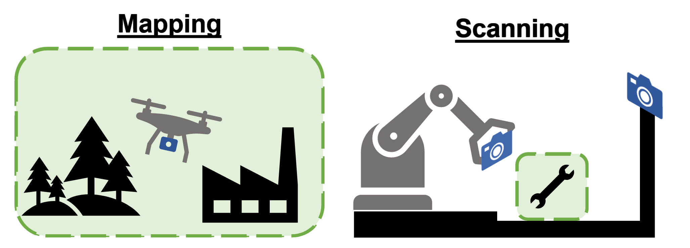
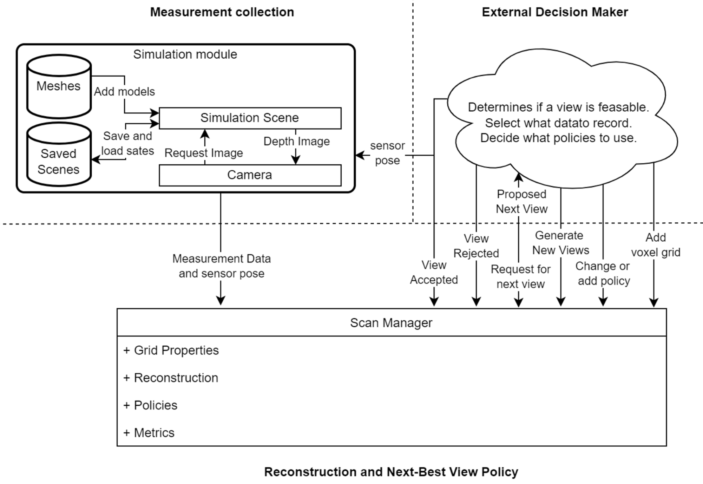

# 🔥🔨 ForgeScan 🤖📸

ForgeScan is a library for developing voxelized reconstructions and next-best view selection policies.

Autonomous robotics systems rely on digital reconstructions of environments and objects to make
decisions. Whether navigating in an evolving space or interacting with a new object, a system must
first observe its surroundings.

    

    

ForgeScan breaks this process into three components: data representations, with focus on voxel data
structures; next-best view selection algorithms; and distance measurements, from sensors depth
cameras.

This project is still in early development and subject to major changes. **This is still primarily
a research tool in its alpha version.** An updated library based on this will be released soon.

## Getting Started

Project documentation is available [here](schellenberg3.github.io/ForgeScan/).

Docker files are [provided](./docker/README.md) with a description and documentation of the
packages required for developing this code on linux systems[^1].

The following collaboration diagram depicts how the `Manager` class, containing the reconstruction
data representation and implements view selection policies, interacts with simulated depth cameras
and overall system.

    

[^1]: The code will compile on windows if the same packages are installed.
